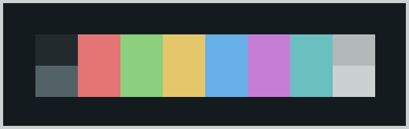
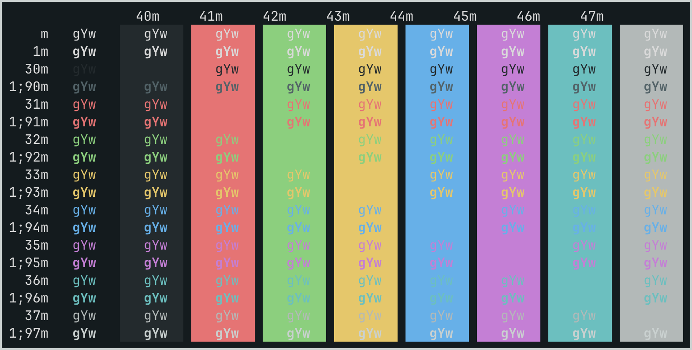

# Everblush Ghostty
My own custom made Everblush color scheme for Ghostty.

 

* [Ghostty for macOS and Linux](https://ghostty.org/)

* [Everblush color scheme](https://everblush.github.io/) 

Place file in ~/.config/ghostty/themes/ (create folders if non-existing).

*Everblush II*

 

